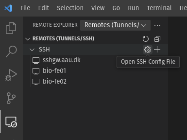

# Shell access through SSH
SSH (Secure Shell) is a widely used protocol for securely gaining access to a shell (or terminal) on remote Linux machines and is the primary way to access the BioCloud servers. This page provides instructions on how to access the BioCloud through SSH using a few different SSH clients on all major platforms. There are many other SSH clients available than those listed below, but regardless of the client, everything will run over the same SSH protocol in the exact same way.

If you need to run interactive GUI (graphical user interface) apps like CLC, Arb, RStudio, VS Code, etc, you don't necessarily need to connect through SSH. Instead you can use the [interactive web portal](webportal.md) described on the next page.

BioCloud is **only** available while connected to the local campus network. To connect from elsewhere you first need to either connect to the university VPN, or configure SSH to connect through a public SSH gateway, see [external access](#external-access) below. You then authenticate using your usual AAU account credentials.

The hostnames of the login nodes are:
 
 - `bio-fe01.srv.aau.dk`
 - `bio-fe02.srv.aau.dk`

After successfully logging in to one of the login nodes using any of the SSH clients mentioned below, please consult and carefully read the [Resource management](../slurm/intro.md) section to learn how to submit computing jobs correctly from a login node.

!!! warning "Login nodes are not for computing workloads"
    It is **strictly forbidden** to run any computing workloads on the login nodes. **Everything** must be submitted to the dedicated compute nodes through SLURM batch jobs - **regardless of their size**. The only purpose of the login nodes is to provide an access point from which you can submit computing jobs to the (much more powerful) dedicated compute nodes, transfer files, edit scripts, and install software. With many concurrent users things add up quickly, and running workloads on the login nodes can easily lead to both performance- and connection problems for everyone.

## Code editors (IDEs)
It's rarely enough with just a terminal because you more often than not need to edit some scripts in order to do anything, which is not very convenient to do in a terminal, so below are some instructions on how to connect using a few popular code editors, or IDEs (integrated development environments), with built-in SSH support, but also [just a terminal](#just-a-terminal).

### Visual Studio Code
[Visual Studio Code](https://code.visualstudio.com/) (VS Code) is a popular free cross-platform code editor with a myriad of [extensions](https://marketplace.visualstudio.com/VSCode) available for anything and everything including syntax highlighting for any programming language, integrated git support, [GitHub copilot](https://github.com/features/copilot) for AI autocompletion of code, and the list goes on. If you want one editor for everything, there isn't currently anything better out there. If you need an interactive VS Code session and actually run things from there, please follow [this guide](../guides/sshdslurm.md) to connect VS Code directly to a SLURM job instead. Alternatively, you can also start a Code Server (an open source alternative to VS Code) in a SLURM job from the [interactive web portal](../access/webportal.md) described on the next page.

#### Installation (Windows, macOS, or Linux)
Download and install using the instructions on the official [website](https://code.visualstudio.com/).

#### Connecting to a login-node
1. Open VS Code and install the "Remote - SSH" extension from the Extensions sidebar menu.
2. Click on the "Remote Explorer" icon after the extension has been installed.
3. Add a host by either:
    - clicking on the "+" icon and enter your AAU email followed by `@` and then the server's hostname, for example: `abc@bio.aau.dk@bio-fe01.srv.aau.dk`, or
    - add all servers at once using the [SSH config template](#ssh-config-file) provided below by clicking the gear icon "Open SSH Config File" and paste its contents (optional).

4. Connect and log in with your SSH password.
5. Once connected open a project or workspace folder (or create one while doing so) by clicking File -> Open Folder (CTRL+k CTRL+o, CMD instead of CTRL if on macOS) to start your work

!!! warning "Project folders in VSCode"
      When connecting using VSCode, please only open individual project folders and **not** your entire home folder. If you do VSCode may scan **all files** in your home folder, which can leave a forever-running process on the login-node consuming all the CPUs available. Instead, it's much better to use workspaces and only add relevant folders one-by-one, if you need to work within multiple folders at once:

      

### MobaXterm
A more old-school and Windows-only client is MobaXterm. It's not as full-featured as VS Code, but is more lightweight.

#### Installation (Windows only)
Download and install MobaXterm Home Edition from the official [website](https://mobaxterm.mobatek.net/download.html).

#### Connecting to a server
1. Open MobaXterm and click on the "Start local terminal" button.
2. In the terminal, use the `ssh` command to connect to a server by entering AAU email followed by `@` and then the server's hostname, for example: `ssh abc@bio.aau.dk@bio-fe01.srv.aau.dk`.

If you add the servers to your [SSH config file](#ssh-config-file) the server hostnames should auto-complete.

### Just a terminal
For a simple terminal you can on Windows use for example [PuTTY](https://www.putty.org/) or [msys2](https://www.msys2.org/), and the integrated terminal and the `ssh` command itself directly if on Linux or macOS (also Windows). Type `ssh email@hostname` like above to connect immediately or just the hostname if you've added them to the [SSH config file](#ssh-config-file).

## Transferring files
Both VS Code and MobaXterm support file transfers, but you can also use other GUI apps like [FileZilla](https://filezilla-project.org/download.php) or [WinSCP](https://winscp.net/eng/index.php). When just using a terminal there are several tools like `scp`, `rsync`, `rclone`, or `sftp`, all of which connect through the SSH protocol. You can also browse and transfer smaller files through the [interactive web portal](webportal.md) described on the next page.

## External access
To access the servers while not directly connected to any AAU or [eduroam](https://eduroam.dk/) network there are two options. Either you connect through VPN, which will route all your traffic through AAU, or you can use the SSH gateway through `sshgw.aau.dk` for SSH connections only. If you need virtual desktop access only VPN will work (for now).

### VPN
The simplest way is to connect to the AAU VPN using the guide provided by ITS [here](https://www.its.aau.dk/vejledninger/vpn). After you connect everything should work as though you were at AAU.

### Using an SSH jump host
The SSH gateway is simply a server hosted at AAU whose only purpose is to bridge SSH connections from the outside (open port 22 ingress) to something else on the internal AAU network. Setting up [2-factor authentication](https://www.its.aau.dk/vejledninger/mfa) is required in order to connect. To enable the "proxy jumping" you need to adjust the [SSH config file](#ssh-config-file) by uncommenting the `ProxyJump sshgw.aau.dk` line under the `*.srv.aau.dk` host, see the [SSH config template file](#ssh-config-file-template). Keep in mind that as long as it's enabled it will always connect through `sshgw.aau.dk` regardless of which network you are connected to, including the AAU network, which is not always ideal.

## Additional configuration (optional)

### SSH config file
To avoid typing hostnames and user names constantly here's a template SSH config file that includes all current servers. The file must be saved at certain locations depending on your OS. On Windows it's [here](https://learn.microsoft.com/en-us/windows-server/administration/openssh/openssh_server_configuration#openssh-configuration-files), and on macOS and Linux it's usually under `~/.ssh/config`. Hostnames in the file will then be auto-completed and if you've set up [SSH public key authentication](#ssh-public-key-authentication) you won't need to type anything else than for example `ssh bio-fe01.srv.aau.dk` and you're in.

#### SSH config file template
```plaintext
# nice-to-have global options that apply to all servers
# prevents disconnects on network glitches and wifi reconnects,
# allows forwarding GUI apps to the client desktop etc
Host *
  ServerAliveInterval 60
  ServerAliveCountMax 2
  ExitOnForwardFailure yes
  ForwardX11 yes
  ForwardX11Trusted yes
  ForwardAgent yes

# use the same user name (and optionally SSH key) everywhere
Host bio-*.srv.aau.dk sshgw.aau.dk
  User abc@bio.aau.dk
  Port 22
  IdentityFile ~/.ssh/biocloud

# login nodes
Host bio-fe01.srv.aau.dk
Host bio-fe02.srv.aau.dk

# jump host for external access (to avoid using VPN)
# uncomment the ProxyJump line to enable
Host sshgw.aau.dk
Host bio-*.srv.aau.dk
#  ProxyJump sshgw.aau.dk

# authenticate with GitHub using an SSH key if needed (check guides section)
Host github.com
    HostName github.com
    User git
    Port 22
    IdentityFile ~/.ssh/github
```

### SSH Public Key Authentication
SSH [public key authentication](https://www.ssh.com/academy/ssh/public-key-authentication) offers a more secure way to connect to a server, and is also more convenient, since you don't have to type in your password every single time you connect through SSH. This is possible by generating a cryptographically linked key pair consisting of a private- and a public key file, where only the public key can be generated from the private key, but **NOT** the other way around. The private key can then be used to authenticate with a server holding the cryptographically linked public key for your user (think of the public key as the lock for the matching private key). You can even add an additional layer of security by encrypting the private key itself using a password when generating the pair. Any SSH client that you choose to use will connect through the SSH program on your computer under the hood, so public key authentication will also apply to them if set up like below. 

If you also want to be able to [connect to GitHub](https://docs.github.com/en/authentication/connecting-to-github-with-ssh) from the terminal through SSH, password authentication is not even allowed - you MUST use public key authentication. A separate guide for that is available under the guides section [here](../guides/git.md).

#### Generating SSH Key Pairs
Generating the key pair must be done locally for security reasons, so that the private key never leaves your computer. If you use a password manager (please do) like [1Password](https://1password.com/) or [bitwarden](https://bitwarden.com/), you can usually both generate and safely store and use SSH keys directly from your vault to avoid having private key files lying around on your computer. It's important that the key is not generated using the (usually) default RSA type algorithm, because it's outdated and can easily be brute-forced with modern hardware, so use for example the `ed25519` algorithm instead.

1. Open your terminal (on Windows called command prompt, hit `win+r` and type `cmd`)
2. Generate an SSH key pair by running the command: `ssh-keygen -t ed25519`
3. Follow the prompts, and save the two keyfiles somewhere safe (the convention is to place it somewhere in the hidden folder `~/.ssh/` in your home folder)

#### Adding Public Keys to the Server
Copy your public key to the server using `ssh-copy-id -i ~/.ssh/biocloud.pub username@hostname`, or manually add the contents of the public key file into the `~/.ssh/authorized_keys` file on any of the servers (the home folder is shared across them all). SSH requires that your user is the only one able to read the contents before you are allowed to login, so ensure the correct permissions are set using `chmod 700 ~/.ssh && chmod 600 ~/.ssh/authorized_keys`.

You should now be able to login securely without typing a password - have fun!