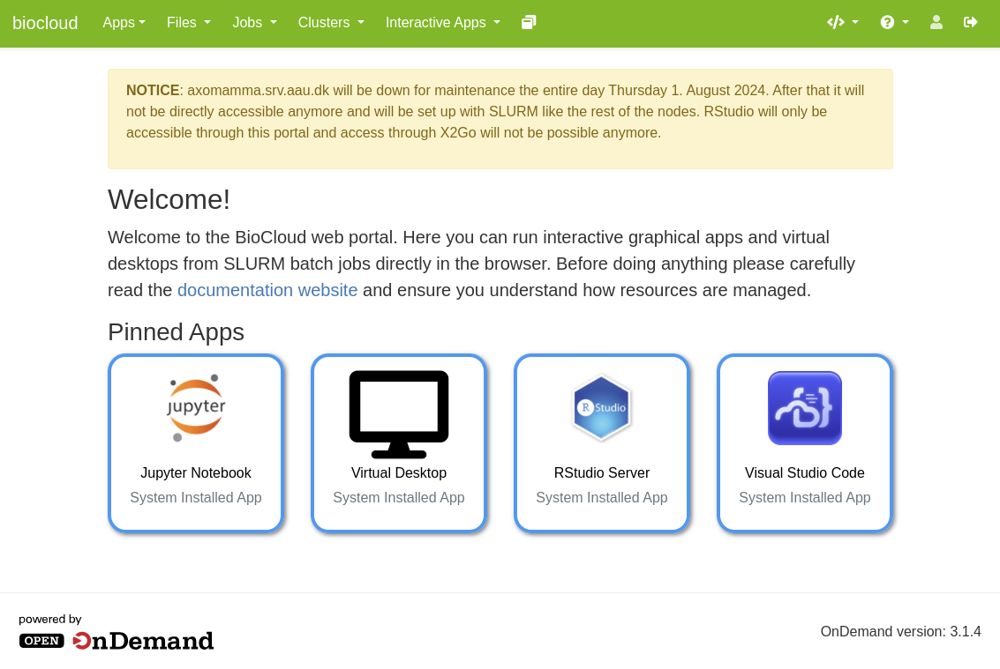

# Interactive Web portal (OpenOndemand)
Another way to access the BioCloud compute resources is to use the interactive web portal based on [Open Ondemand](https://openondemand.org/) developed by [Ohio Supercomputer Center](https://www.osc.edu/). The main purpose of the web portal is to greatly simplify running interactive and graphical apps such as virtual desktops and IDEs, which are served directly from isolated SLURM jobs running on the compute nodes, but you can also easily browse around and transfer files, obtain a shell, check the job queue, or compose job batch scripts based on templates, and more - all from your browser without having to learn a multitude of terminal commands.

This page only describes briefly how to connect to the web portal. Guides detailing how to use all of its features are available under the [Guides section](../guides/webportal/files.md). It is also **absolutely essential** to read and understand how SLURM and [resource management](../slurm/intro.md) works, before using any of the apps, because interactive apps are often terribly inefficient (i.e. CPUs do nothing when you are just typing or clicking around)!

## Getting access
In order to access the web portal you must first be connected to the local AAU campus network, or [through VPN](ssh.md#vpn). Then go to [https://biocloud.bio.aau.dk](https://biocloud.bio.aau.dk) and log in using your usual AAU credentials if you aren't already (for example if you've already signed in to your AAU webmail, etc). Now you should be greeted by the front page.

???+ warning "Your home folder must exist before you can access"
      If this is the first time you ever log in to any of the BioCloud servers, your home directory does not yet exist on the [storage](../storage/intro.md) and you will likely see an error when trying to log in to the web portal. To create your home directory you must first log in [through SSH](ssh.md) once as described on the previous page. You can also contact an admin to create it for you if you are having trouble.

Now, please read through the SLURM guide on the following pages before using any of the apps. Afterwards you can go through the guides for the individual apps under the [Guides section](../guides/webportal/files.md).