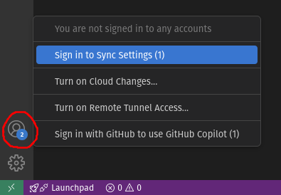
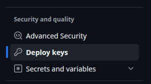
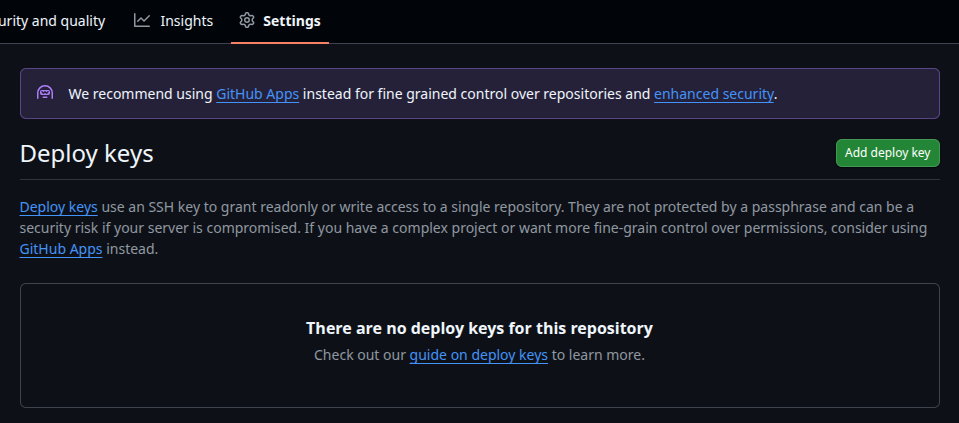
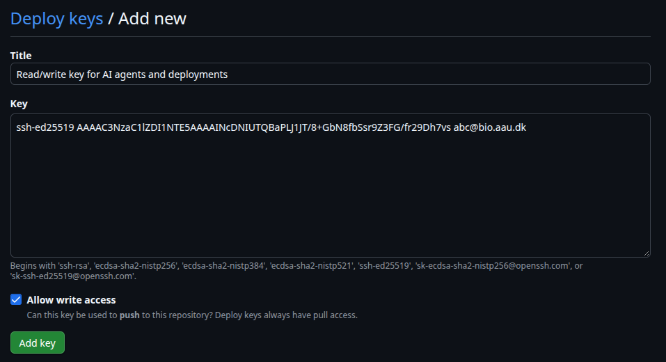
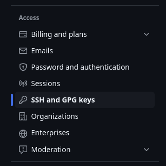
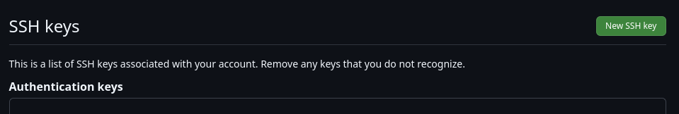
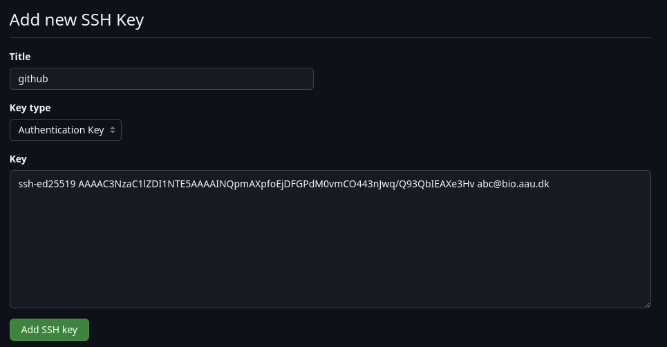

# Connecting to GitHub
A short guide to authenticating with GitHub from BioCloud. For more details, see the official GitHub guide [Connecting to GitHub with SSH](https://docs.github.com/en/authentication/connecting-to-github-with-ssh).

## Connecting from VSCode
If you only use [Git in VSCode](https://code.visualstudio.com/docs/sourcecontrol/intro-to-git), just sign in with GitHub from the "Accounts" icon in the bottom left corner:



This doesn't work in the [Code Server app](webportal/apps/coder.md), in which case read on.

## Connecting from the command line
To use git from the command line or other applications you must authenticate with an SSH key or a personal access token. There are four options:

| | [Agent forwarding](#option-1-forward-your-ssh-agent) | [SSH key on BioCloud](#option-2-ssh-key-on-biocloud) | [Deploy keys](#option-3-deploy-keys-per-repository) | [Personal access token](#option-4-personal-access-token) |
|---|---|---|---|---|
| Credentials stored on BioCloud | No | Yes | Yes | Yes |
| Access to | All your repositories | All your repositories | One repository per key | Selected repositories |
| Works in batch jobs and the Code Server app | No | Yes | Yes | Yes |
| Pull requests, issues etc. from BioCloud | Yes | Yes | No | Yes, if permitted |
| Expires | No | No | No | Yes |

!!! warning
    Anything running as your user on BioCloud can use the key, including scripts and AI agents. Use deploy keys or personal access tokens to limit access to specific repositories.

### Option 1: Forward your SSH agent
Use the SSH key on **your own computer**. The key never leaves your computer.

1. [Create an SSH key and add it to your GitHub account](#add-an-ssh-key-to-your-github-account) on your own computer, then add it to the SSH agent with `ssh-add ~/.ssh/github` (on Windows, [enable the ssh-agent service](https://learn.microsoft.com/en-us/windows-server/administration/openssh/openssh_keymanagement#user-key-generation) first).
2. Add `ForwardAgent yes` to the BioCloud hosts in your `~/.ssh/config`. VSCode forwards the agent by default.
3. Connect to BioCloud and [test the connection](#test-the-connection).

!!! warning "Only forward to trusted hosts"
    Never set `ForwardAgent yes` under `Host *`. Use `ssh-add -c` to confirm every use of the key on your computer.

### Option 2: SSH key on BioCloud
[Create an SSH key and add it to your GitHub account](#add-an-ssh-key-to-your-github-account) **on BioCloud**. Protect it with a password, since it's stored on a shared filesystem.

### Option 3: Deploy keys (per repository)
A [deploy key](https://docs.github.com/en/authentication/connecting-to-github-with-ssh/managing-deploy-keys#deploy-keys) only grants access to a single repository. Limitations:

- Only git operations (clone, pull, push). **Pull requests, issues etc. are not possible** from BioCloud. Push a branch and create the pull request on github.com instead.
- Requires admin access to the repository.
- One key pair per repository.

Generate a key pair for the repository:
```
ssh-keygen -t ed25519 -C "myrepo deploy key" -f ~/.ssh/deploy_myrepo
chmod 400 ~/.ssh/deploy_myrepo
```

On github.com, go to the repository -> Settings -> "Deploy keys":



Click "Add deploy key":



Paste the contents of `~/.ssh/deploy_myrepo.pub`, tick "Allow write access" to be able to push, and click "Add key":



Clone the repository using the key:
```
git clone -c core.sshCommand="ssh -i ~/.ssh/deploy_myrepo -o IdentitiesOnly=yes" git@github.com:username/myrepo.git
```

Or, for an existing clone, run from within the repository:
```
git config core.sshCommand "ssh -i ~/.ssh/deploy_myrepo -o IdentitiesOnly=yes"
git remote set-url origin git@github.com:username/myrepo.git
```

`IdentitiesOnly=yes` prevents SSH from trying other keys first, which otherwise causes `Repository not found` or `Too many authentication failures` errors.

### Option 4: Personal access token
A [fine-grained personal access token](https://docs.github.com/en/authentication/keeping-your-account-and-data-secure/managing-your-personal-access-tokens#creating-a-fine-grained-personal-access-token) is used over HTTPS instead of SSH. It can be limited to selected repositories and permissions, and it expires.

On github.com, go to your profile picture -> Settings -> "Developer settings" -> "Personal access tokens" -> "Fine-grained tokens" -> "Generate new token":

- **Expiration**: as short as practical.
- **Repository access**: "Only select repositories".
- **Permissions**: "Contents" read and write to pull and push. Add "Pull requests" read and write to create pull requests.

Copy the token, it's only shown once. Repositories owned by an organization may require approval of the token by an organization owner.

Store the token for the repository, run from within the repository folder:
```
git config credential.helper "store --file=$HOME/.git-credentials-myrepo"
git remote set-url origin https://github.com/username/myrepo.git
git pull
```
Enter your GitHub username, and the token as password. It's then saved for future use.

!!! warning
    Never put the token in the remote URL, as it will be shown by `git remote -v`, in error messages, and will be copied with the repository. The credentials file is stored unencrypted, so keep the expiration short and the permissions minimal.

## Add an SSH key to your GitHub account
Used for [option 1](#option-1-forward-your-ssh-agent) (on your own computer) and [option 2](#option-2-ssh-key-on-biocloud) (on BioCloud). Generate a key pair, and protect it with a password when asked:
```
mkdir -p ~/.ssh
chmod 700 ~/.ssh
ssh-keygen -t ed25519 -C "your_email@example.com" -f ~/.ssh/github
chmod 400 ~/.ssh/github
```
On Windows, run only `ssh-keygen -t ed25519 -f $HOME\.ssh\github` in PowerShell.

Copy the public key printed by `cat ~/.ssh/github.pub` (in a terminal, copy with `CTRL/CMD+SHIFT+C`). On [github.com](https://github.com), go to your profile picture -> Settings -> "SSH and GPG keys":



Click "New SSH key":



Paste the public key and click "Add SSH key":



Finally, add the following to `~/.ssh/config` on the same machine (already in the [SSH config template](../access/ssh.md#ssh-config-file-template)):
```
Host github.com
    HostName github.com
    User git
    IdentityFile ~/.ssh/github
```

## Test the connection
```
$ ssh -T git@github.com
Hi USERNAME! You've successfully authenticated, but GitHub does not provide shell access.
```
To test a deploy key, add `-i ~/.ssh/deploy_myrepo -o IdentitiesOnly=yes`. It greets you with the repository name instead.

To test a personal access token, run `git ls-remote` from within the repository.
