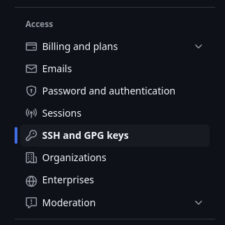
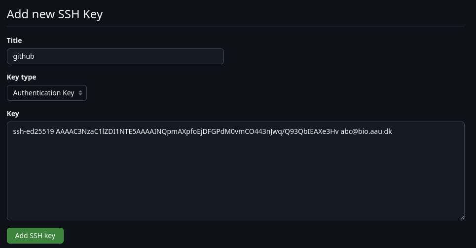

# Connecting to GitHub
This guide describes how to connect and authenticate with GitHub through SSH. It's a boiled down version of the official GitHub guide [Connecting to GitHub with SSH](https://docs.github.com/en/authentication/connecting-to-github-with-ssh) covering only basic functionality, so if you need additional features go read that instead.


## Connecting to GitHub from VS Code
VS Code has a fantastic builtin source control feature with everything you need. If you only need to use [Git in VS Code](https://code.visualstudio.com/docs/sourcecontrol/intro-to-git), you don't need to do much else than just sign in with GitHub by clicking on the "Accounts" icon in the bottom left corner:


This will also synchronize all your settings across devices. Note that authenticating with GitHub in this way is not possible when using the [Code Server app](webportal/apps/coder.md), in which case you must read on.

## Connecting through SSH
To be able to commit and push changes to GitHub repositories (or to pull private repositories) through the git command line, or from practically any application with git support, you must connect through SSH using [public key authentication](https://www.ssh.com/academy/ssh/public-key-authentication) very similarly to how you would connect to a [login node through SSH using a key-pair](../access/ssh.md#ssh-public-key-authentication). GitHub simply doesn't support password authentication for SSH access anymore because it's very insecure. The only alternative to SSH keys is [personal access tokens](https://docs.github.com/en/authentication/keeping-your-account-and-data-secure/managing-your-personal-access-tokens), but they are more suited for fine-grained control within large organizations and non-interactive API integrations etc.

### Generate an SSH key pair

Start by generating a key pair using the below commands. The email is not strictly necessary, but can help you differentiate multiple keys. You will also be asked whether you want to encrypt the private key file using a password, which is recommended for extra security, especially when the private key file will be located on a shared filesystem. If you choose to do so it can be handy to also [add the key to the SSH agent](https://docs.github.com/en/authentication/connecting-to-github-with-ssh/generating-a-new-ssh-key-and-adding-it-to-the-ssh-agent#adding-your-ssh-key-to-the-ssh-agent) to avoid having to type the password every single time you want to commit, push, and pull etc. For windows users, however, [it can be troublesome](https://docs.github.com/en/authentication/connecting-to-github-with-ssh/managing-deploy-keys#ssh-agent-forwarding), so you can skip this step and instead rely on proper permissions ensuring that you are the only user with read access to the file:

```
mkdir -p ~/.ssh
chmod 700 ~/.ssh
ssh-keygen -t ed25519 -C "your_email@example.com" -f ~/.ssh/github
chmod 400 ~/.ssh/github
```

### Add the public key to GitHub
Now you must add the public key file to GitHub to allow access (think of it as "the lock", and the private key file "the key" to it). Copy the contents of the public key file using a terminal editor, fx `nano ~/.ssh/github.pub` (use `CTRL/CMD+SHIFT+C`, and NOT `CTRL/CMD+C`, which means interrupt). Then sign in to [github.com](https://github.com), go to settings by clicking your profile picture in the top right corner, then find "SSH and GPG keys" in the menus under "Access":



Click "New SSH key":


Paste the contents of the public key file and click "Add SSH key":



The email will be removed automatically. If you now go to `http://github.com/yourusername.keys`, you should see the public key listed there.

### Configure SSH
As the last step, you need to configure SSH to automatically use the new private key when connecting to GitHub by adding the following to the `~/.ssh/config` file. If you've used the SSH config template file provided in the [Shell access through SSH](../access/ssh.md#ssh-config-file-template) guide, it will already be there, so you can skip this step:
```
# authenticate with GitHub using an SSH key if present
Host github.com
    HostName github.com
    User git
    Port 22
    IdentityFile ~/.ssh/github
```

### Test the connection
Now test the connection by running `ssh -T github.com`. If you see the below message, it works!
```
$ ssh -T github.com
Hi USERNAME! You've successfully authenticated, but GitHub does not provide shell access.
```

https://docs.github.com/en/authentication/connecting-to-github-with-ssh/managing-deploy-keys#deploy-keys
