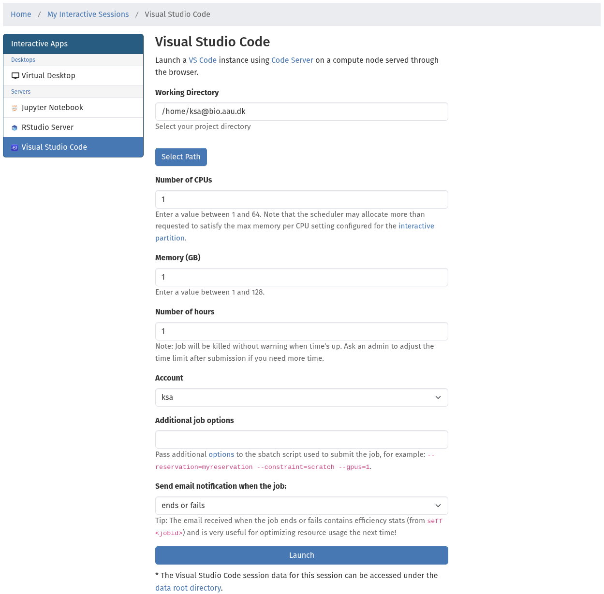
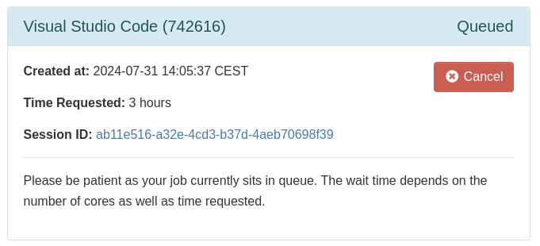
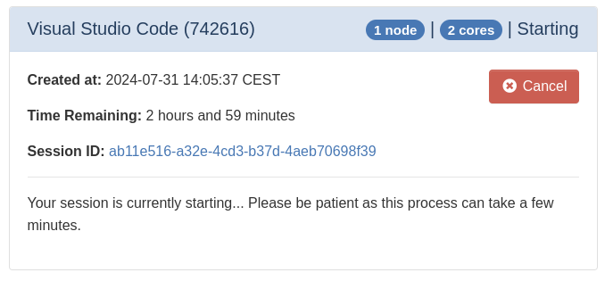
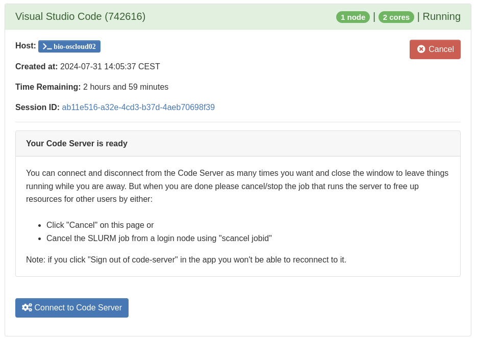
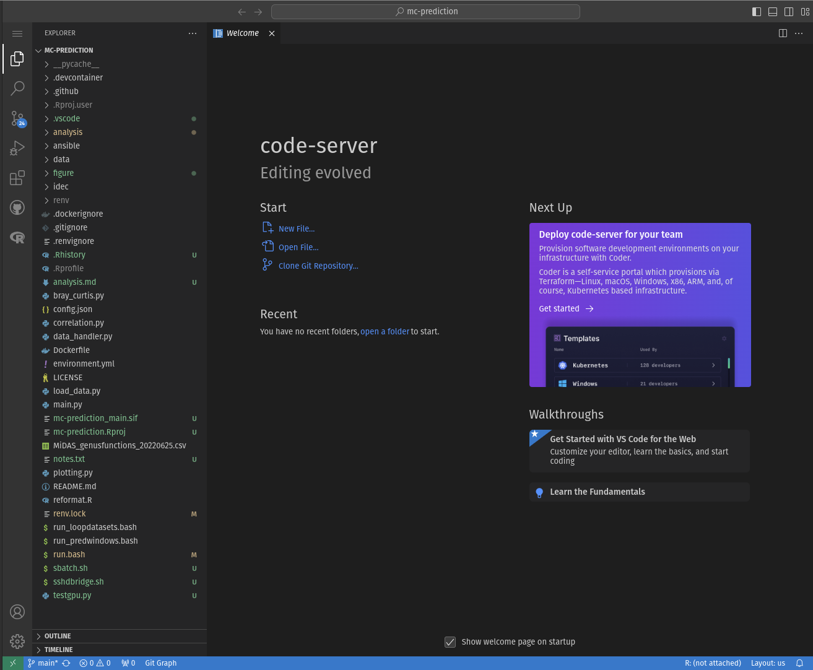

# Code server
[Code Server](https://github.com/coder/code-server) is an open source alternative to [Visual Studio Code](https://code.visualstudio.com/) provided by [Coder](https://coder.com/), which can be run through a web browser. It's based on much of the same code base and has the exact same features overall, however there are minor differences. If you want the full VS Code experience you must follow [this guide](../../sshdslurm.md) instead. This app will allow you to run a Code Server in a SLURM job and access it directly from your browser.

Before continuing, please first follow the guide to [getting access to the OpenOndemand web portal](../../../access/webportal.md).

## Starting the app
Start by selecting the desired working directory where Code will start (you can also change this inside), and the amount of resources that you expect to use and for how long:

If you need to use a node with specific [features](../../../slurm/jobsubmission.md#requesting-compute-nodes-with-special-features), for example if you need some fast and [local scratch space](../../../storage/local.md), or otherwise need to pass any additional options to the Slurm `sbatch` command used to launch the job, you can enter them in the "additional job options" field. Then click Launch!

## Accessing the app
When you've clicked **Launch** SLURM will immediately start finding a compute node with the requested amount of resources available, and you will see a **Queued** status. When the chosen compute node partition is not fully allocated this usually only takes a few seconds, however if it takes longer, you can check the job status and the reason why it's pending under the [Jobs](../jobqueue.md) menu, or by using [shell commands](../../../slurm/jobcontrol.md#get-job-status-info).

When the job has been granted a resource allocation the server needs a little while to start and you will see the status change to **Starting**

and when it finishes a button will appear to launch Code Server:

You can now start working:

???+ info "Closing the window"
    If you close the window or browser tab while something is running, it will continue to run in the background. You can always reconnect to it by clicking the **Connect to Code Server** button again.

## Stopping the app
When you are done with your work, it's important to stop the app to free up resources for other users. You can do that by clicking the red **Cancel** button under **My Interactive Sessions**, see the screenshots above.

!!! warning "Always inspect and optimize efficiency for next time!"
    When the job completes, **!!!ALWAYS!!!** inspect the CPU and memory usage of the job in either the notification email received or using [these commands](../../../slurm/accounting.md#job-efficiency-summary) and adjust the next job accordingly! This is essential to avoid wasting resources which other people could used, and to reduce queue time.
