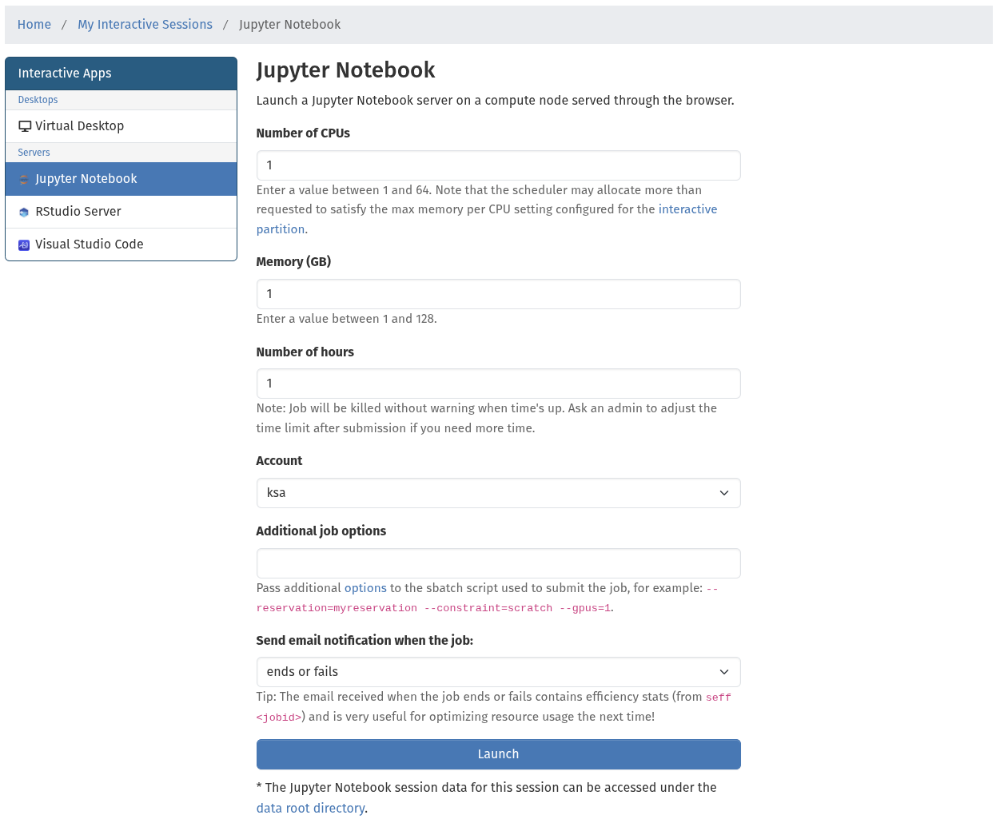
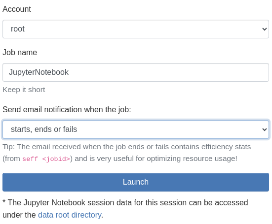
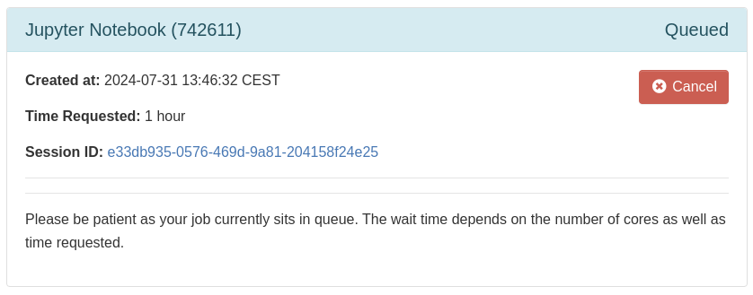
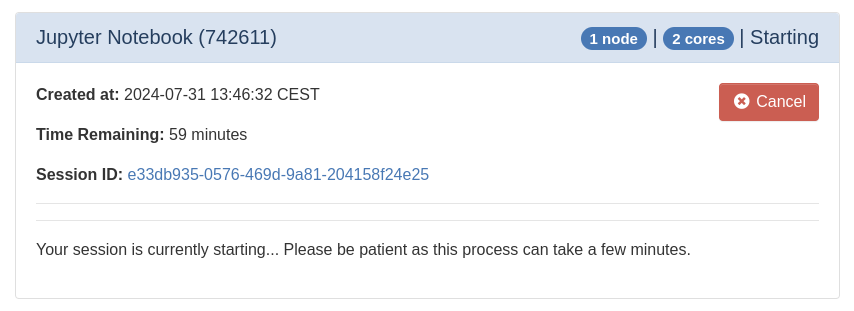
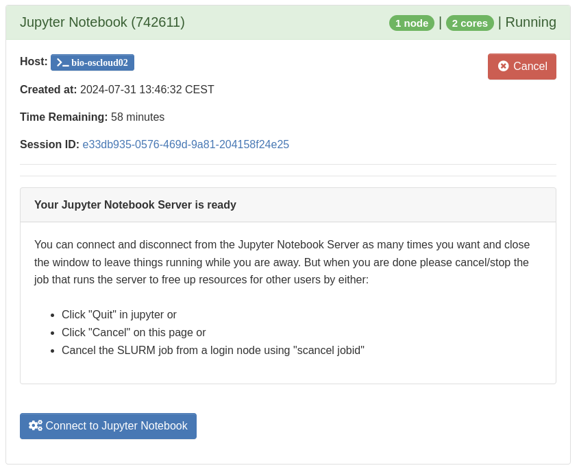
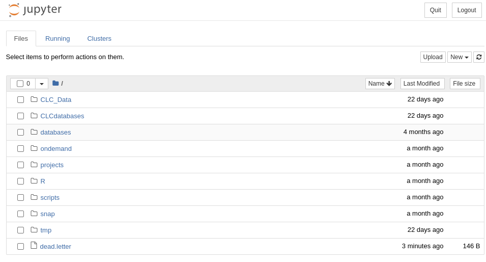
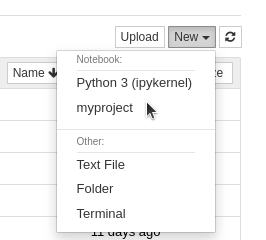
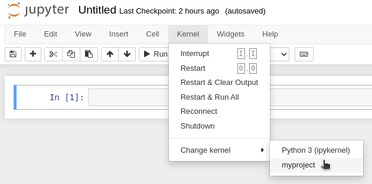

# Jupyter notebook
[Jupyter Notebook](https://jupyter.org/) is a web application for creating and sharing computational documents. It offers a simple, streamlined, document-centric experience. This app will allow you to run a Jupyter Notebook server in a SLURM job and access it directly from your browser.

Before continuing, please first follow the guide to [getting access to the OpenOndemand web portal](../../../access/webportal.md).

## Starting the app
Start by selecting the amount of resources that you expect to use and for how long:



Now it's important to choose an appropriate [hardware partition](../../../slurm/partitions.md) for your job. You almost always want to use the `shared` partition where CPUs are shared, however if you are sure that you will keep them busy for most of the duration by [optimizing CPU efficiency](../../../slurm/efficiency.md), or if you need a lot of memory, you can go ahead and use other partitions. Otherwise, please just use the `shared` partition. If you need to use a specific node, for example if you need some fast and [local scratch space](../../../storage.md#local-scratch-space), you can type the hostname in the **Nodelist** field, otherwise just leave it blank. Keep in mind that selecting individual compute nodes may result in additional queue time.


Lastly, you can give the job an appropriate name and choose when you would like to receive an email. Most users don't need to choose between different accounts, since your user will likely only belong to a single one, in which case just leave it as-is. Then click Launch!



## Accessing the app
When you've clicked **Launch** SLURM will immediately start finding a compute node with the requested amount of resources available, and you will see a **Queued** status. When the chosen hardware partition is not fully allocated this usually only takes a few seconds, however if it takes longer, you can check the job status and the reason why it's pending under the [Jobs](../jobqueue.md) menu, or by using [shell commands](../../../slurm/jobcontrol.md#get-job-status-info).



When the job has been granted a resource allocation the server needs a little while to start and you will see the status change to **Starting**



and when it finishes a button will appear to launch the notebook:



You can now start working:



## Stopping the app
When you are done with your work, it's important to stop the app to free up resources for other users. You can do that by either clicking the **Quit** button inside the notebook server in the top right corner:


or click the red **Cancel** button under **My Interactive Sessions**, see the screenshots above.

!!! warning "Always inspect and optimize efficiency for next time!"
    When the job completes, **!!!ALWAYS!!!** inspect the CPU and memory usage of the job in either the notification email received or using [these commands](../../../slurm/accounting.md#job-efficiency-summary) and adjust the next job accordingly! This is essential to avoid wasting resources which other people could have used.


## Installing Python packages for Jupyter

### From PyPI
If the exact Python version isn't important to you, you can install packages from pipy using `pip` directly from a notebook using for example `!pip install matplotlib`. However, this will use the default python version installed on the system, which cannot be changed and will be upgraded from time to time, which can result in incompatibilities and break dependencies between packages after each upgrade. To manage both the python version and python packages it's better to use conda environments.

### Using conda environments
You can use [conda environments]() to manage software and python packages and make them available for Jupyter notebooks by installing `ipykernel` into any environment as a separate [kernel](https://docs.jupyter.org/en/latest/projects/kernels.html):

```
conda activate myproject
conda install ipykernel
python -m ipykernel install --user --name myproject --display-name myproject
```

This will install the kernel into `${HOME}/.local/share/jupyter/kernels` with the chosen display name and make it visible from Jupyter. Select the new kernel either when creating a new notebook:



or when already working on a notebook by changing kernel from the menus:



In a similar way you can also run R code in Jupyter notebooks by installing the [IRkernel](https://irkernel.github.io/) into an environment:
```
conda activate myproject
conda install r-irkernel
R -e "IRkernel::installspec(name = 'myproject-Rkernel', displayname = 'myproject-Rkernel')"
```

You should see the R logo when you've chosen the correct kernel:


If you need to install R packages, don't run any `install.packages()` commands, you must [install R packages into the conda environment](../../../software/conda.md#r-and-installing-r-packages-within-conda-environments) instead.
