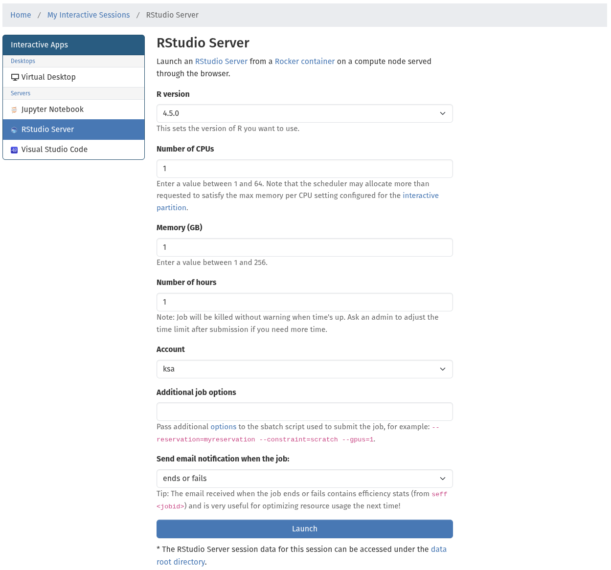
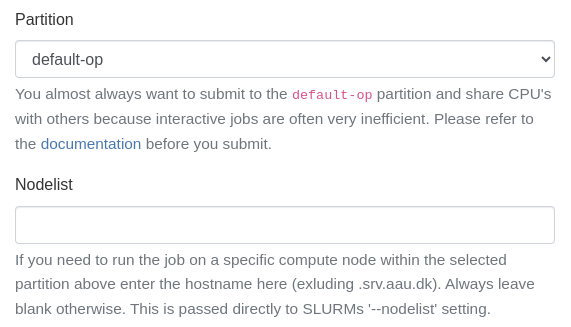
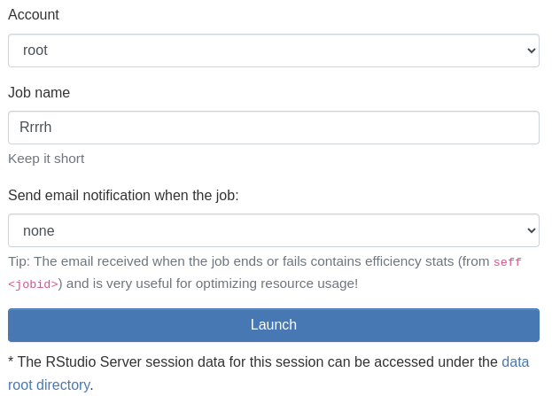
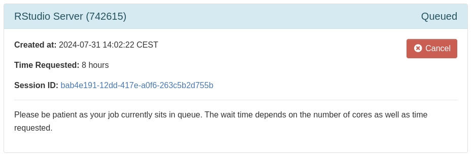
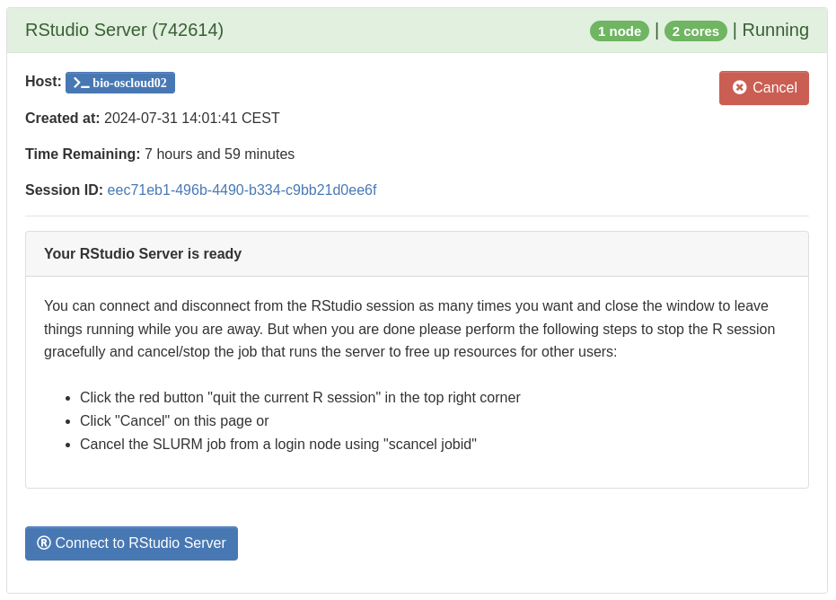
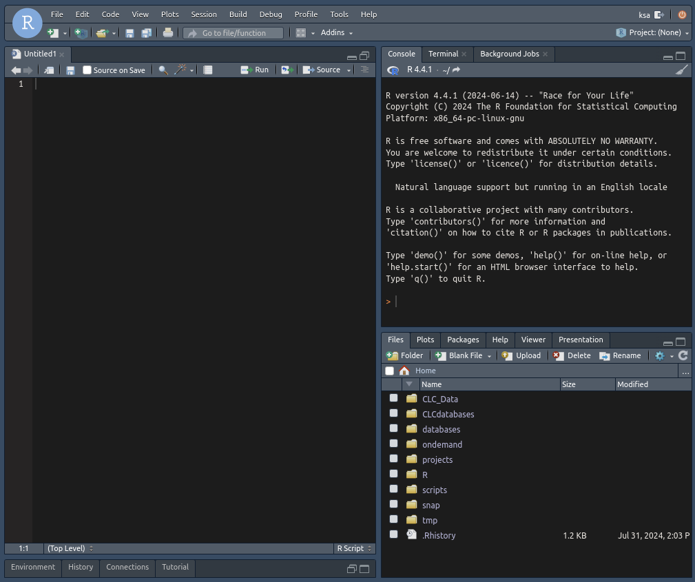

# RStudio
[RStudio](https://posit.co/products/open-source/rstudio/) is an integrated development environment (IDE) for R and Python. It includes a console, syntax-highlighting editor that supports direct code execution, and tools for plotting, history, debugging, and workspace management. This app will allow you to run an RStudio server in a SLURM job and access it directly from your browser.

Before continuing, please first follow the guide to [getting access to the OpenOndemand web portal](../../../access/webportal.md).

## Starting the app
Start by selecting the desired R version and the amount of resources that you expect to use and for how long:

Now it's important to choose an appropriate [compute node partition](../../../slurm/partitions.md) for your job. You almost always want to use the `interactive` partition where CPUs are interactive, however if you are sure that you will keep them busy for most of the duration by [optimizing CPU efficiency](../../../slurm/efficiency.md), or if you need a lot of memory, you can go ahead and use other partitions. Otherwise, please just use the `interactive` partition. If you need to use a specific node, for example if you need some fast and [local scratch space](../../../storage.md#local-scratch-space), you can type the hostname in the **Nodelist** field, otherwise just leave it blank. Keep in mind that selecting individual compute nodes may result in additional queue time.

Lastly, you can give the job an appropriate name and choose when you would like to receive an email. Most users don't need to choose between different accounts, since your user will likely only belong to a single one, in which case just leave it as-is. Then click Launch!

## Accessing the app
When you've clicked **Launch** SLURM will immediately start finding a compute node with the requested amount of resources available, and you will see a **Queued** status. When the chosen compute node partition is not fully allocated this usually only takes a few seconds, however if it takes longer, you can check the job status and the reason why it's pending under the [Jobs](../jobqueue.md) menu, or by using [shell commands](../../../slurm/jobcontrol.md#get-job-status-info).

When the job has been granted a resource allocation the server needs a little while to start and you will see the status change to **Starting**

and when it finishes a button will appear to launch RStudio:

You can now start working:

???+ info "Closing the window"
    If you close the window or browser tab while something is running, it will continue to run in the background. You can always reconnect to it by clicking the **Connect to RStudio Server** button again.

## Stopping the app
When you are done with your work, it's important to stop the app to free up resources for other users. Before you do that, however, it's a good idea to first click the little red button inside RStudio in the top right corner to shut down the R session gracefully:

Then stop the job by clicking the red **Cancel** button under **My Interactive Sessions**, see the screenshots above.

!!! warning "Always inspect and optimize efficiency for next time!"
    When the job completes, **!!!ALWAYS!!!** inspect the CPU and memory usage of the job in either the notification email received or using [these commands](../../../slurm/accounting.md#job-efficiency-summary) and adjust the next job accordingly! This is essential to avoid wasting resources which other people could have used.

## Containerization
The RStudio server runs in the SLURM job from within a [singularity/apptainer container](../../../software/containers.md#singularityapptainer), that is based on [Rocker](https://rocker-project.org/) container images. This means that R packages installed from the RStudio app may not work with other R installations due to different base operating system packages, so the RStudio app uses a different R library location by default, which is located under `$HOME/R/rstudio-server/R_MAJOR_VERSION`.

Furthermore, because RStudio is running in an isolated Linux container, you cannot for example load your usual conda environments or issue SLURM commands from the integrated terminal, etc. Only the Ceph network storage mount points are available at their usual locations, but everything else is otherwise completely isolated from the host on which the container runs.
