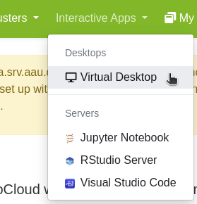
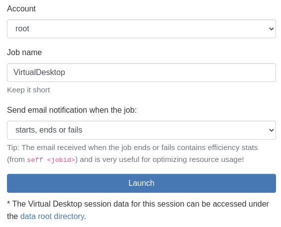
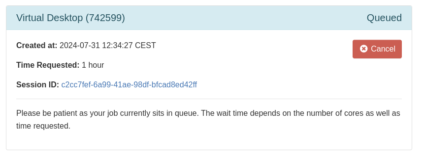
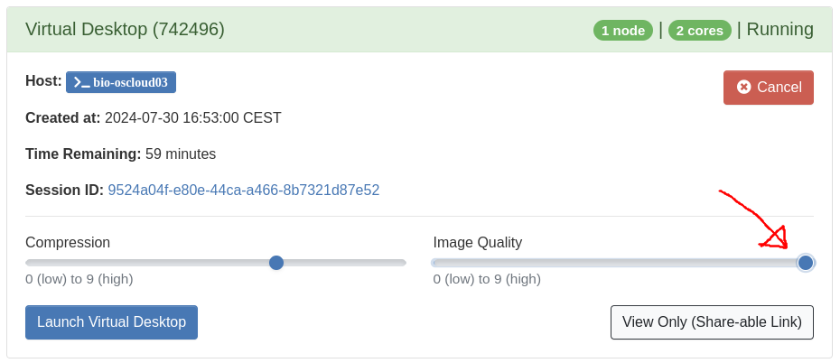
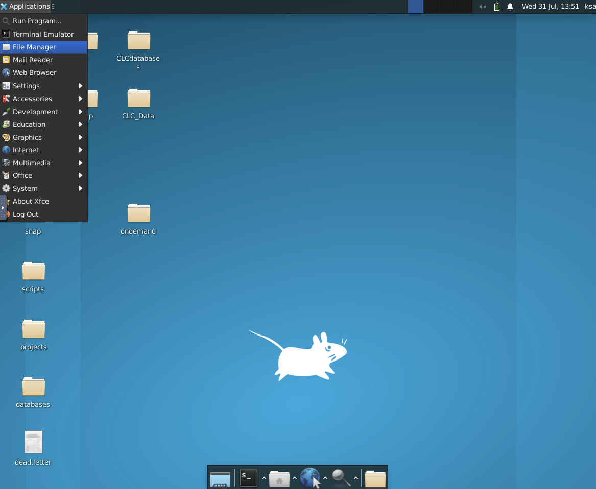
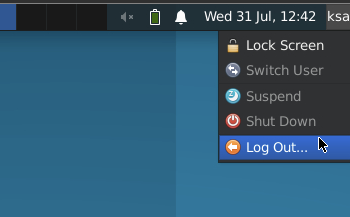

# Virtual Desktop
You can start a virtual desktop on any compute node and access it directly through the browser without having to install and set up any software on your own computer first to access it. This is useful for running GUI software that doesn't run from a command line, but instead needs to show up in graphical windows where you can click around like you are used to on your personal computer.

Before continuing, please first follow the guide to [getting access to the OpenOndemand web portal](../../../access/webportal.md).

## Starting the app
Click the **Virtual Desktop** app icon on the front page or select it from the **Interactive Apps** menu bar at the top:

Start by selecting the amount of resources that you expect to use and for how long:

Now it's important to choose an appropriate [hardware partition](../../../slurm/partitions.md) for your job. You almost always want to use the `shared` partition where CPUs are shared, however if you are sure that you will keep them busy for most of the duration by [optimizing CPU efficiency](../../../slurm/efficiency.md), or if you need a lot of memory, you can go ahead and use other partitions. Otherwise, please just use the `shared` partition. If you need to use a specific node, for example if you need some fast and [local scratch space](../../../storage.md#local-scratch-space) or use licensed software (fx CLC), you can type the hostname in the **Nodelist** field, otherwise just leave it blank. Keep in mind that selecting individual compute nodes may result in additional queue time.

???+ "CLC workbench"
      If you want to use the CLC workbench from a virtual desktop, you must use the node `axomamma`, because CLC is only licensed for this particular machine. Additionally, the maximum number of CPUs allowed per CLC instance is 64. You can find CLC in the menus.

Lastly, you can give the job an appropriate name and choose when you would like to receive an email. Most users don't need to choose between different accounts, since your user will likely only belong to a single one, in which case just leave it as-is. Then click Launch!

## Accessing the app
When you've clicked **Launch** SLURM will immediately start finding a compute node with the requested amount of resources available, and you will see a **Queued** status. When the chosen hardware partition is not fully allocated this usually only takes a few seconds, however if it takes longer, you can check the job status and the reason why it's pending under the [Jobs](../jobqueue.md) menu, or by using [shell commands](../../../slurm/jobcontrol.md#get-job-status-info).

When the SLURM scheduler has granted an allocation for the job, you will see the status change to **Running** and a button will appear to launch the virtual desktop:

Ensure that the **Image Quality** slider is maximized. You don't need to adjust the **Compression** level unless you are on a poor network connection, in which case you can increase it. You can also share the session with other people, which can be handy for fx teaching. Now, click **Launch**, and you should see a desktop like this within a few seconds:

You can now start running anything you want, browse the Applications menu at the top left to find and launch your software.

???+ info "Closing the window"
    If you close the window or browser tab while something is running, it will continue to run in the background. You can always reconnect to it by clicking the **Launch Virtual Desktop** button again.

## Stopping the app
When you are done with your work, it's important to stop the app to free up resources for other users. You can do that by either clicking **Log Out** inside the virtual desktop in the top right corner:

or click the red **Cancel** button under **My Interactive Sessions**, see the screenshots above.

!!! warning "Always inspect and optimize efficiency for next time!"
    When the job completes, **!!!ALWAYS!!!** inspect the CPU and memory usage of the job in either the notification email received or using [these commands](../../../slurm/accounting.md#job-efficiency-summary) and adjust the next job accordingly! This is essential to avoid wasting resources which other people could have used.
