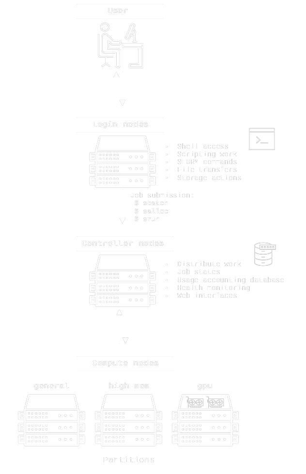

# Introduction to SLURM
SLURM (Simple Linux Utility for Resource Management) is a highly flexible and powerful job scheduler for managing and scheduling computational workloads on high-performance computing (HPC) clusters. SLURM is designed to efficiently allocate resources and manage job execution on clusters of any size, from a single server to tens of thousands. SLURM manages resources on an HPC cluster by dividing similar compute nodes into [partitions](partitions.md). Users submit jobs with specified resource requirements to these partitions from a login-node, and then the SLURM controller schedules and allocates resources to those jobs based on available resources. SLURM also stores detailed usage information of all jobs in a usage accounting database, which allows enforcement of fair-share policies and priorities for job scheduling for each partition.

## BioCloud SLURM cluster overview


(Note: the exact partitions in the figure may be outdated, but the setup is the same)

## Getting started
Start with obtaining shell access to one of the login nodes `bio-fe[01-02].srv.aau.dk`, as described on the [SSH access](../access/ssh.md) page. To start with it's always nice to get an overview of the cluster, it's partitions, and how many resources that are currently allocated. This is achieved with the `sinfo` command, example output:

```
$ sinfo
  PARTITION AVAIL  TIMELIMIT  CPUS(A/I/O/T)     STATE       REASON  NODES        NODELIST AVAIL_FEATURES
interactive    up 1-00:00:00   70/218/0/288     mixed         none      1      bio-node11 zen5,epyc9565
       zen5    up 14-00:00:0  456/120/0/576     mixed         none      2 bio-node[12-13] zen5,epyc9565
       zen5    up 14-00:00:0  106/150/0/256     mixed         none      1      bio-node17 zen5,epyc9535
       zen5    up 14-00:00:0    0/256/0/256      idle         none      1      bio-node16 zen5,epyc9535
      zen3*    up 14-00:00:0   164/92/0/256     mixed         none      1      bio-node01 scratch,zen3,epyc7713
      zen3*    up 14-00:00:0   46/146/0/192     mixed         none      1      bio-node02 zen3,epyc7552
      zen3*    up 14-00:00:0  270/306/0/576     mixed         none      3 bio-node[03,06- zen3,epyc7643
      zen3*    up 14-00:00:0   90/102/0/192     mixed         none      1      bio-node05 scratch,zen3,epyc7643
      zen3*    up 14-00:00:0    192/0/0/192 allocated         none      1      bio-node04 zen3,epyc7643
      zen5x    up 14-00:00:0  276/300/0/576     mixed         none      2 bio-node[14-15] scratch,zen5,epyc9565
      zen3x    up 14-00:00:0   164/28/0/192     mixed         none      1      bio-node08 zen3,epyc7643
      zen3x    up 14-00:00:0  100/156/0/256     mixed         none      1      bio-node09 zen3,epyc7713
    gpu-a10    up 14-00:00:0      0/64/0/64      idle         none      1      bio-node10 scratch,zen3,epyc7313,a10
```

To get an overview of running jobs use `squeue`, example output:
```
# everything
$ squeue
  JOBID              NAME       USER  ACCOUNT        TIME   TIME_LEFT CPU MIN_MEM ST PRIO   PARTITION NODELIST(REASON)
2144804 OOD-RStudioServer user01@stu students     4:13:59     4:46:01  10     64G  R  340 interactive bio-node11
2144803 OOD-VirtualDeskto user02@bio      kln     5:07:40     6:52:20  12     24G  R  325 interactive bio-node11
2144808 OOD-RStudioServer user03@bio      phn     3:14:15     1:45:45  20    100G  R  270 interactive bio-node11
2144913    OOD-CodeServer user04@bio       md       46:11     7:13:49  10     20G  R  142 interactive bio-node11
2144912 OOD-RStudioServer user04@bio       md       46:21     7:13:39   4     25G  R  141 interactive bio-node11
2144807 OOD-RStudioServer user05@bio       ma     3:31:15     8:28:45   1     12G  R   78 interactive bio-node11
2144806    OOD-CodeServer user05@bio       ma     3:31:28     8:28:32   1      8G  R   78 interactive bio-node11
2144816 OOD-RStudioServer user06@bio       ma     2:51:17     5:08:43  10     50G  R   75 interactive bio-node11
2141338       semibin.S16 user07@bio       md  3-00:49:43 10-07:10:17  64    300G  R  351        zen3 bio-node04
2141351       concoct.S16 user07@bio       md  2-23:31:34 10-08:28:26  32    300G  R  342        zen3 bio-node01
2141299 817356b7-2ccc-4b9 user08@bio       ma  1-04:52:39  6-19:07:21  90    900G  R  284        zen3 bio-node03
2141298 817356b7-2ccc-4b9 user08@bio       ma  1-05:47:55  6-18:12:05  90    900G  R  284        zen3 bio-node07
2141297 817356b7-2ccc-4b9 user08@bio       ma  1-08:20:52  6-15:39:08  90    900G  R  284        zen3 bio-node05
2141290 817356b7-2ccc-4b9 user08@bio       ma  1-13:22:11  6-10:37:49  90    900G  R  284        zen3 bio-node06
2141259           mmlong2 user08@bio       ma  3-08:33:36  5-15:26:24  65    300G  R  278        zen3 bio-node01

# your own jobs only
$ squeue --me
 JOBID         NAME       USER       TIME    TIME_LEFT CPU MIN_ME ST PARTITION NODELIST(REASON)
  3333 as-predictio user09@bio 2-19:42:49   6-04:17:11   5    16G  R   gpu-a10 bio-node10
```

Or get a more detailed overview per compute node of current resource allocations and which jobs are running etc. This will normally show some colored bars, but they are not visible here.
```
$ sstatus
Cluster allocation summary per partition or individual nodes (-n).
(Numbers are reported in free/allocated/total).

Partition   |              CPUs               |           Memory (GB)            |       GPUs        |
=====================================================================================================
interactive |  220 68                  /288   | 1198 303                 /1501   |           
zen5        |  537 551                 /1088  | 2572 3433                /6005   |           
zen3        |  649 759                 /1408  |  967 5512                /6479   |           
zen5x       |  300 276                 /576   |  942 3572                /4514   |           
zen3x       |  184 264                 /448   |  604 3383                /3987   |           
gpu-a10     |   64 0                   /64    |  241 0                   /241    |    2 0         /2    
-----------------------------------------------------------------------------------------------------
Total:      | 1954 1918                /3872  | 6525 16204               /22729  |    2 0         /2    

Total resources requested from queued jobs:
  CPUs: 74 (3.6K CPU hours)

Jobs running/queued/total:
  42 / 1 / 43

Use sinfo or squeue to obtain more details.
```
