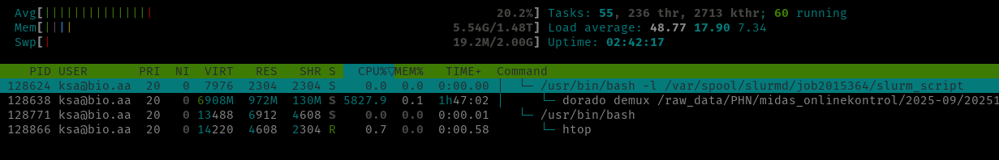

# Job submission
Once you are [logged in](../access/ssh.md) to one of the login nodes through SSH, there are several ways to request resources and run jobs at different complexity levels through SLURM. Here are the most essential ways for interactive (foreground) and non-interactive (background) use. Usually, you only need to be acquainted with 3 SLURM job submission commands depending on your needs. These are [`srun`](https://slurm.schedmd.com/archive/slurm-24.11.4/srun.html), [`salloc`](https://slurm.schedmd.com/archive/slurm-24.11.4/salloc.html), and [`sbatch`](https://slurm.schedmd.com/archive/slurm-24.11.4/sbatch.html). They all share the exact same [options](#most-essential-options) to define trackable resource constraints ("TRES" in SLURM parlor, fx number of CPUs, memory, GPU, etc), time limits, email for job status notifications, and many other things, but are made for different use-cases, which will be described below.

## Interactive jobs
An interactive job is useful for quick testing and development purposes, where you only need resources for a short period of time to experiment with scripts or workflows on minimal test data, before submitting larger batch jobs using [`sbatch`](#batch-jobs-non-interactive-jobs) that are expected to run for much longer in the background.

To immediately request and allocate resources (once available) and start an **interactive shell** session directly on the allocated compute node(s) through SLURM, just type [`salloc`](https://slurm.schedmd.com/archive/slurm-24.11.4/salloc.html):

```
$ salloc
```

Here SLURM will find a compute node with the default amount of resources available (which is currently 1CPU, 512MB memory, and a 1-hour time limit) and start the session on the allocated compute node(s) within the requested resource constraints. If you need more resources you need to explicitly ask for it, for example:

```
$ salloc --cpus-per-task 2 --mem 4G --time 0-3:00:00
```

Resources will then remain allocated until the shell is terminated with `CTRL+d`, typing `exit`, or closing the window. If it takes more than a few seconds to allocate resources, your job might be queued due to a variety of reasons. If so check the [`REASON` codes](jobcontrol.md#get-job-status-info) for the job with `squeue` from another session.

???+ warning "Interactive jobs and CPU efficiency"
      When using an interactive shell through [`salloc`](https://slurm.schedmd.com/archive/slurm-24.11.4/salloc.html) it's important to keep in mind that the allocated resources remain reserved entirely for you until you `exit` the shell session. So please don't leave it hanging idle for too long if you know you are not going to actively use it, otherwise other users might have needed the resources in the meantime. Furthermore, interactive jobs are usually very inefficient, because the allocated CPU's do absolutely nothing when you are just typing or clicking around. Therefore, interactive jobs will run on the dedicated `interactive` partition, which is optimized for inefficient jobs.

If you just need to run a single command/script in the foreground, it's much better to use [`srun`](https://slurm.schedmd.com/archive/slurm-24.11.4/srun.html) instead of [`salloc`](https://slurm.schedmd.com/archive/slurm-24.11.4/salloc.html), which will run things immediately on a compute node instead of first starting an interactive shell. As opposed to [`salloc`](https://slurm.schedmd.com/archive/slurm-24.11.4/salloc.html) the job is terminated **immediately** once the command/script finishes, which increases CPU utilization:

```
$ srun --cpus-per-task 8 --mem 16G --time 1-00:00:00 mycommand myoptions
```

The terminal will be blocked for the entire duration, hence for longer running jobs it's much more convenient to instead write the commands in a script and [submit a non-interactive batch job](#batch-jobs-non-interactive-jobs) using `sbatch`, which will run in the background. For shorter commands, you can also instead of `srun <options> <command>` use the [`--wrap` option](https://slurm.schedmd.com/archive/slurm-24.11.4/sbatch.html#OPT_wrap) to `sbatch` to submit it as a non-interactive batch job, for example:

```
sbatch --cpus-per-task 2 --mem 4G --time 0-01:00:00 --wrap "mycommand myoptions"
```

[`srun`](https://slurm.schedmd.com/archive/slurm-24.11.4/srun.html) is sometimes also used to run multiple tasks/steps (parallel processes) from within batch scripts, which can then span multiple compute nodes and run concurrently.

???- info "Connectivity and interactive jobs"
      Keep in mind that with interactive jobs briefly losing connection to the login-node can result in the job being killed. This is to avoid that resources would otherwise remain blocked due to unresponsive shell sessions hanging until time runs out. If you still see the job in the `squeue` overview, however, use [`sattach`](https://slurm.schedmd.com/archive/slurm-24.11.4/sattach.html) to reattach to a running interactive job, just remember to append `.interactive` to the job ID, fx `38.interactive`.

### Graphical (GUI) apps
#### From the command line
In order to run graphical applications, simply append the [`--x11` option](https://slurm.schedmd.com/archive/slurm-24.11.4/srun.html#OPT_x11) to `salloc` or `srun` and run the program. The graphical app will then show up in a window on your own computer, while running inside a SLURM job on the cluster:
```
$ salloc --cpus-per-task 2 --mem 4G --time 0-3:00:00 --x11
$ command_to_start_graphical_app
```

It's important to mention that in order for this to work properly, you must first ensure that you have connected to the particular login node using either the `ssh -X` option, or that you have set the `ForwardX11 yes` option in your SSH config file, [see example here](../access/ssh.md#ssh-config-file).

#### From the interactive web portal (Open Ondemand)
To run graphical/interactive software, you can also just use the [interactive web portal](../guides/webportal/apps/virtualdesktop.md) to start a virtual desktop and run it in there. This is especially handy if it needs to run for a long time, because you can log off while it's running and come back later to check the status. Just remember to **stop/cancel the job** as soon as possible to free up resources for other users. If the particular software is started from the command line, you could simply append `mycommand && scancel <jobid>` to the command to automatically stop the job serving the virtual desktop once the command has finished running.

## Batch jobs (non-interactive jobs)
The most convenient and **highly recommended** way to run most things is by submitting jobs to the job queue for execution in the background in the form of SLURM batch scripts through the `sbatch` command. Resource requirements are instead defined by `#SBATCH` comment-style directives at the top of a shell script, and the script is then submitted to SLURM using a simple `sbatch script.sh` command. This is ideal for submitting large jobs that will run for many hours or days, but of course also for testing/development work. A SLURM batch script should always contain (in order):

 - Any number of `#SBATCH` lines with options defining resource constraints and other [options](#most-essential-options) for the subsequent SLURM task(s) to be run.
 - A list of commands to load any required conda environments needed for **all tasks**. This can also be done separately within any external scripts being executed from the job.
 - The main body of the script/workflow, or call to an external script or program to run within the job.

Submit the batch script to the SLURM job queue using `sbatch script.sh`, and it will then start once the requested amount of resources are available (also taking into account your past usage and priorities of other jobs etc, all 3 job submission commands do that). If you set the `--mail-user` and `--mail-type` arguments you should get a notification email once the job starts and finishes with additional details like how many resources you have actually used compared to what you have requested. This is essential information for future jobs to avoid overbooking and maximize resource utilization of the cluster.

You can also simply add `#SBATCH` lines to any shell script you already have, and also run the script with arguments, so for example instead of `bash script.sh -i input -o output ...` you can simply run `sbatch script.sh -i input -o output ...`.

???+ warning "ALWAYS check up on running and recently completed jobs"
      The queue time and efficiency of the whole cluster is directly dependent on the average CPU efficiency of all jobs. It is therefore extremely important to ensure that your job uses all the CPU's that you've requested for most of the duration of the job. If not, please cancel the job and submit a new one with fewer CPU's, or adjust the job to use all the CPU's more efficiently. Furthermore, please ALWAYS also [check up on the CPU efficiency](usagereporting.md#job-efficiency-summary) of recently finished jobs by either checking the stats in job notification emails or by using `seff <jobid>` and adjust your next submissions accordingly to avoid idle CPU's.

???- "Non-interactive job output (`stdout`/`stderr` streams)"
      The job is handled in the background by the SLURM daemons on the individual compute nodes, so you won't see any output in the terminal. It will instead be written to the file(s) defined by `--output` and/or `--error`. To follow along in real time run for example `tail -f job_123.out` from a login node.

### Single-node, single-task example
A simple example SLURM `sbatch` script for a single task could look like this:

```
#!/usr/bin/bash -l
#SBATCH --job-name=myjob
#SBATCH --output=job_%j_%x.out
#SBATCH --cpus-per-task=10
#SBATCH --mem=10G
#SBATCH --time=0-04:00:00
#SBATCH --mail-type=END,FAIL,TIME_LIMIT_90
#SBATCH --mail-user=abc@bio.aau.dk

# Exit script on the first error
set -euo pipefail

# Load conda environment to make required software available
mamba activate minimap2

# Obtain number of CPUs available from the SLURM allocation itself
# (It's best practice to use the same variable everywhere from here and onwards. If you fx change the resource requirements above it's easy to forget to update it everywhere)
max_threads="$(nproc)"

# Run any number of commands as part a full pipeline script or call scripts from elsewhere
minimap2 -t "$max_threads" database.fastq input.fastq > out.file
```

### Array jobs
If you need to run the same command or script multiple times with different input files, parameters, or arguments, you can use SLURM arrays. This allows you to submit any number of jobs at once, which can then run simultaneously in parallel across the cluster. By making the unique array ID for each job within the array available with the [environment variable](other.md#slurm-environment-variables) `SLURM_ARRAY_TASK_ID`, you can ensure that each job will run with a different input file, parameter, or argument, etc. Each job within the array will get their respective job array ID appended to the parent job ID, for example `<jobid>_[0,1,2,3]`, and can be [controlled](jobcontrol.md) individually. You can also set `--mail-type=ARRAY_TASKS` to receive notification emails for each task in the array if necessary.

```
#!/bin/bash -l
#SBATCH --job-name=myarray_job
#SBATCH --output=job_%j_%x_%a.out
#SBATCH --cpus-per-task=10
#SBATCH --mem=10G
#SBATCH --time=0-04:00:00
#SBATCH --mail-type=END,FAIL,TIME_LIMIT_90,ARRAY_TASKS
#SBATCH --mail-user=abc@bio.aau.dk
#SBATCH --array=0-8

# Run a script for all files in a folder
FILES=(/path/to/data/*)
./my_script ${FILES[$SLURM_ARRAY_TASK_ID]}

# Or run a script with a predefined list of arguments, files, folders, or anything else
ARGS=(0.1 0.2 0.3 0.4 0.5 0.6 0.7 0.8 0.9)
./my_script ${ARGS[$SLURM_ARRAY_TASK_ID]}
```

???+ Important
      The `bash -l` in the top "shebang" line is required for the compute nodes to be able to load conda environments correctly.

## Requesting one or more GPUs
If you need to use one or more GPUs add `--gres=gpu:model:x` to the `sbatch`, `salloc`, or `srun` commands, where `model` is one of the available GPU models (see [GPU partitions](partitions.md#gpu-partitions) for available models), and `x` is the number of GPUs to request, for example: `--gres=gpu:a10:1`. You can also ask for any GPU regardless of model by just excluding it, for example `--gres=gpu:1`, but note that there can be quite a big difference between GPUs. Please never do CPU work on GPU nodes unless you also need a GPU. Additional details [here](https://slurm.schedmd.com/archive/slurm-24.11.4/gres.html).

## Requesting compute nodes with special features
If you need to run your job on compute nodes with special node features, for example if you need local scratch space or a specific CPU model/generation, you can use the `--prefer` or `--constraint` options. A list of features for each compute node can be found under [Compute node partitions](partitions.md). The `--prefer` option will only prefer nodes with the specified list of features, but if no such nodes are available it will still run the job on any other available node. The `--constraint` option will instead **require** the specified features to be available on the compute node(s), and if no nodes with the required features are available the job will be queued until such nodes become available. For example, to ensure that the job will run on a compute node with the `zen5` CPU generation and local scratch space, you can use:

```
$ sbatch --constraint=zen5,scratch batchscript.sh
```

If you simply want to prefer nodes with the later `zen5` CPU generation, but don't require it, you can use:

```
$ sbatch --prefer=zen5 batchscript.sh
```

Of course these options can be written in the `#SBATCH` section of batch scripts as well.

## How to check up on the resource utilization of running jobs
When jobs start running, it's important to check up on them once in a while to ensure that they run as intended before potentially wasting resources for a long time (especially CPUs). This can be done by starting an interactive shell session within running (non-interactive batch) jobs using the `srun` command. First, obtain the job ID from the queue using `sq` (convenient alias for `squeue --me`):

```
$ sq
  JOBID   NAME       USER ACCOUNT  TIME  TIME_LEFT CPU MIN_MEM ST PRIO PARTITION NODELIST(REASON)
2015364 dorado ksa@bio.aa     phn 32:00    2:28:00  64     32G  R  265      zen5 bio-node13
```

The job ID is also printed to the terminal when submitting jobs. Then, you can monitor the resource usage of all processes running within the job from the inside in real time using `htop` or `top` (and `nvidia-smi` or `nvtop` for GPU jobs).

```
$ srun --jobid <jobid> --pty bash
$ htop
```

When using `htop` you can hit `u` to filter processes to only show those running by your user, and `t` for tree view to see the process tree started from each slurm job on the node.



In this example I have allocated 64 CPUs and 32GB memory for the job and currently keeping about 58 CPUs busy. That is great, but I'm barely using any memory, so the next time I should probably ask for less memory if it stays at this level for the entire duration of the job. Memory is only a maximum though, only peak memory usage matters.

Note that if the job spans multiple nodes you have to specify which node to connect to using the `--nodelist` option. Secondly, only a single interactive shell can be active within the same job allocation at any one time.

## Most essential options
There are plenty of options with the SLURM job submission commands. Below are the most important ones for our current setup and common use-cases. If you need anything else you can start with the [SLURM cheatsheet](https://slurm.schedmd.com/pdfs/summary.pdf), or refer to the SLURM documentation for the individual commands [`srun`](https://slurm.schedmd.com/archive/slurm-24.11.4/srun.html), [`salloc`](https://slurm.schedmd.com/archive/slurm-24.11.4/salloc.html), and [`sbatch`](https://slurm.schedmd.com/archive/slurm-24.11.4/sbatch.html).

| Option | Default value(s) | Description |
| --- | --- | --- |
| `--job-name`                                 | The name of the script | A user-defined name for the job or task. This name helps identify the job in logs and accounting records. |
| `--begin`                                    | `now` | Specifies a start time for the job to begin execution. Jobs won't start before this time. [Details here](https://slurm.schedmd.com/archive/slurm-24.11.4/sbatch.html#OPT_begin). |
| `--output`, `--error`                        | `slurm-<jobid>.out` | Redirect the job's standard output/error (`stdout`/`stderr`) to a file, ideally on network storage. All directories in the path must exist before the job can start. By default `stderr` and `stdout` are merged into a file `slurm-%j.out` in the current workdir, where `%j` is the job allocation number. See filename patterns [here](https://slurm.schedmd.com/archive/slurm-24.11.4/sbatch.html#SECTION_%3CB%3Efilename-pattern%3C/B%3E). |
| `--ntasks-per-node`                          | `1` | Specifies the number of tasks to be launched per allocated compute node. |
| `--ntasks`                                   | `1` | Indicates the total number of tasks or processes that the job should execute. |
| `--cpus-per-task`                            | `1` | Sets the number of CPU cores allocated per task. Required for parallel and multithreaded applications. |
| `--mem`, `--mem-per-cpu`, or `--mem-per-gpu` | `512MB` (per node) | Specifies the memory limit per node, or per allocated CPU/GPU. These are mutually exclusive. |
| `--nodes`                                    |  `1` | Indicates the total number of compute nodes to be allocated for the job. |
| `--nodelist`                                 |  | Specifies a comma-separated list of specific compute nodes to be allocated for the job. |
| `--exclusive`                                |  | Flag. If set will request exclusive access to a full compute node, meaning no other jobs will be allowed to run on the node. In this case you might as well also use all available memory by setting `--mem=0`, unless there are suspended jobs on the particular node. [Details here](https://slurm.schedmd.com/archive/slurm-24.11.4/sbatch.html#OPT_exclusive). |
| `--gres`                                     |  | List of "generic consumable resources" to use, for example a GPU. [Details here](https://slurm.schedmd.com/archive/slurm-24.11.4/sbatch.html#OPT_gres). |
| `--prefer` or `--constraint` | | Prefer or require specific node features (see [Compute node partitions](partitions.md)), respectively. [Details here](https://slurm.schedmd.com/archive/slurm-24.11.4/sbatch.html#OPT_prefer)  |
| `--reservation`                                | | Allocate resources for the job from the named reservation(s). Can be a comma-separated list of more than one. [Details here](https://slurm.schedmd.com/archive/slurm-24.11.4/sbatch.html#OPT_reservation) |
| `--chdir`                                    |  | Set the working directory of the batch script before it's executed. Setting this using environment variables is not supported. |
| `--time`                                     | `0-01:00:00` | Defines the maximum time limit for job execution before it will be killed automatically. Format `DD-HH:MM:SS`. Maximum allowed value is that of the partition used. [Details here](https://slurm.schedmd.com/archive/slurm-24.11.4/sbatch.html#OPT_time) |
| `--mail-type`                                | `NONE` | Configures email notifications for certain job events. One or more comma-separated values of: `NONE`, `ALL`, `BEGIN`, `END`, `FAIL`, `REQUEUE`, `ARRAY_TASKS`. `TIME_LIMIT_90`, `TIME_LIMIT_80`, and `TIME_LIMIT_50` might also become handy to be able to extend the time limit before the job is killed. [Details here](https://slurm.schedmd.com/archive/slurm-24.11.4/sbatch.html#OPT_mail-type) |
| `--mail-user`                                | Local user | Specifies the email address where job notifications are sent. |
| `--x11`                                      | `all` | Enable forwarding of graphical applications from the job to your computer. It's required that you have either connected using the `ssh -X` option or you have set the `ForwardX11 yes` option in your [SSH config file](../access/ssh.md#ssh-config-file). For `salloc` or `srun` only. [Details here](https://slurm.schedmd.com/archive/slurm-24.11.4/srun.html#OPT_x11). |
| `--wrap` | | For `sbatch` only. Submit a command string as a batch script. [Details here](https://slurm.schedmd.com/archive/slurm-24.11.4/sbatch.html#OPT_wrap). |
