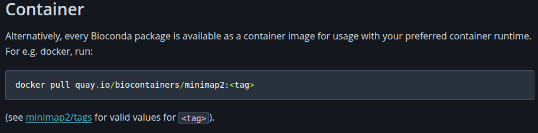
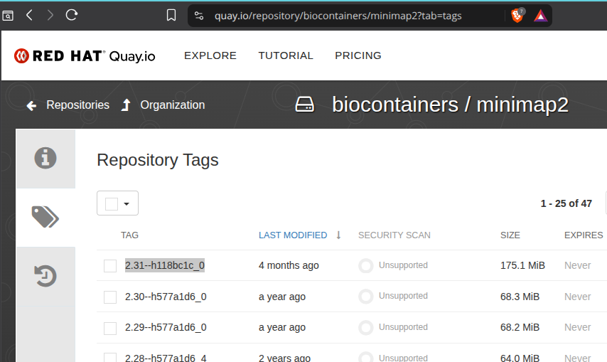

# Containers
[Containers](https://www.docker.com/resources/what-container/) provide a convenient and portable way to package and run applications in a completely isolated and self-contained environment, making it easy to manage dependencies and ensure complete reproducibility and portability. Compared to [conda environments](conda.md) or software modules containers are always based on a base operating system image, usually Linux, ensuring that even the operating system is under control. Once a container is built and working as intended, it will run exactly the same forever, wherever, and is therefore the best way to for example bundle and distribute production-level workflows. By containerizing the application platform and its dependencies, differences in OS distributions and underlying infrastructure are abstracted away completely. Linux containers allow users to:

 - Easily use software with otherwise complicated dependencies and environment requirements
 - Run an application container from the [Sylabs Container Library](https://cloud.sylabs.io/
), [Docker Hub](https://hub.docker.com/), or from self-made images from the [GitHub container registry](https://ghcr.io)
 - Use a package manager (like apt or yum) that normally requires elevated privileges to install software without changing anything on the host system
 - Run an application that was built for a different distribution of version of Linux than the host OS
 - Archive an analysis for long-term reproducibility and/or publication

Furthermore, when using containers, all software and exact versions (image tags) are written in-line with your code, so you don't have to provide separate installation instructions or a list of specific dependencies that must first be made available in order for your script to run - it will all be "contained" in one file!

## Singularity/Apptainer
[Singularity/Apptainer](https://apptainer.org/docs/user/main/index.html) is a tool for running software containers on HPC systems, but is made specifically with scientific computing in mind. Singularity allows running Docker and any other OCI-based container natively and is a replacement for Docker on HPC systems. Singularity has a few extra advantages:

 - Security: a user in the container is the same user with the same privileges/permissions as the one running the container, so no privilege escalation is possible
 - Ease of deployment: no daemon running as root on each node, a container is simply an executable
 - Ability to run workflows that require MPI and GPU support

### Pre-built container images specifically for bioinformatic software
Similar to [conda packages](conda.md), usually it's not necessary to build a container image yourself unless you want to customize things in detail, since there are a plethora of free, pre-built container images already publicly available that work straight of the box. For bioinformatic software the community-driven project [biocontainers.pro](https://biocontainers.pro/) has made **ALL** conda packages from the [bioconda channel](https://bioconda.github.io/index.html) available as container images, so it should contain anything and everything you need (more than 11000 at the time of writing), and if not - you can contribute! All their container images are hosted on the container registry [quay.io](https://quay.io/organization/biocontainers), but they are also listed in the [bioconda package index](https://bioconda.github.io/conda-package_index.html). Under each tool there should be a "Container" section like this one, where you should see a link to a list of available tags:



Container images are always tagged for each version or release, so you have to **pick a specific tag, otherwise you will likely get an error**. But that's perfect, because it **enforces reproducibility**! Using specific tags ensures that the container image never (EVER) changes, and thus will continue to run even decades from now on any system. Pick a tag from the list and copy it's name. For example to run `minimap2` you would likely choose the most recent tag `2.31--h118bc1c_0`:



???+ warning "Never use a `latest` tag!"
        NEVER use a "`latest`" tag if available! You will obtain different versions of the container image (and thus the software it contains) depending on when the container image is pulled every time you run your code (though individual image tags are of course cached locally). This can cause downstream trouble, inconsistent output, and code that used to work just fine can suddenly break - all impacting reproducibility significantly. Not exactly the point.

To now run the tool simply prepend `apptainer run docker://quay.io/biocontainers/image:tag` to the command you would normally use to run the tool, and that's it. For example to run a simple `minimap2` mapping, you would normally write something like this in your batch scripts:

```
minimap2 database.fastq input.fastq > out.file
```

To run minimap2 from a container instead, write for example:

```
apptainer run docker://quay.io/biocontainers/minimap2:2.31--h118bc1c_0 minimap2 database.fastq input.fastq > out.file
```

And **that's it!**

It's easy to adapt all your current scripts to use containers this way instead of using [conda environments](conda.md), which can be slow to build, but more importantly they often contain tens of thousands of files, which can significantly burden the network storage when many users use conda environments simultaneously. **It's therefore recommended to use containers as much as possible!**

???+ important "Files in your home folder can cause trouble!"
      In addition to the [network storage mount points](../storage/intro/#mount-points_1), by default the `/tmp` folder, your home folder, and the folder from where apptainer is run are mounted and made available inside the container. However, sometimes configuration files at standardized locations within your home folder may interfere with whatever is installed and configured inside the container (for example conda or R packages), and it may be necessary to avoid mounting your home folder entirely by using `--no-home`.

### Pulling a container image to a file
Apptainer will normally cache the images you pull, which is ideal because people often use some of the same tools across multiple projects. But alternatively, you can also pull the container images to a single file if necessary and run from that instead:

```
# pull a container from a registry to a file
$ apptainer pull ubuntu_22.04.sif docker://ubuntu:22.04

# run a container from a file with default options
$ apptainer run ubuntu_22.04.sif yourcommand --someoption somefile

# start an interactive shell within a container
$ apptainer shell ubuntu_22.04.sif
```

### Building container images
You can [build an apptainer container image](https://apptainer.org/docs/user/main/build_a_container.html) from a definition file using `apptainer build`, which will produce a `.sif` file with everything included. You can also build containers externally by:

 - using your own system (laptop/workstation) where you have root/elevated privileges to install Singularity or Docker and build containers
 - using a free cloud container build service like [https://cloud.sylabs.io](https://cloud.sylabs.io) or [https://hub.docker.com/](https://hub.docker.com/)
 - by publishing a `Dockerfile` to a GitHub repository and use GitHub actions to build and publish the container to the GitHub container registry

Then transfer the container image file(s) to BioCloud or publish it to a public container registry and pull it using `apptainer pull`. This is ideal if your code needs to be publicly available too as part of a study, enabling complete reproducibility for anyone.

#### Bundling conda environments in a container
cotainr is perhaps the easiest way to [bundle conda environments inside an apptainer container](https://cotainr.readthedocs.io/en/stable/user_guide/conda_env.html) by simply giving a path to an environment yaml file (see the [conda page](conda.md#creating-an-environment)) and choosing a base image from for example [docker hub](https://hub.docker.com/):

```
cotainr build --base-image docker://ubuntu:22.04 --conda-env condaenv.yml myproject.sif
```

This will produce a single file anyone can use anywhere apptainer is installed, regardless of platform and local differences in setup, etc.

If you need to run a tool from within a conda environment that has been packaged into a docker image by someone else, depending on how the container image has been designed and built, apptainer may not be able to detect and load the conda environment first and the tool will not be available. The solution is simple though. Start a shell to figure out where conda is installed, then rebuild the apptainer image by adding 

```
Bootstrap: docker
From: user/image:tag

%environment
  source /opt/conda/etc/profile.d/conda.sh
  conda activate myenv
```

`apptainer build myimage.sif myimage.def`. Apptainer should now correctly activate the environment first before running any commands. Or run `apptainer exec myimage.sif conda run -n myenv yourcommand --someoption somefile`.

???+ info "Build containers on a login node, not within a slurm job"
    Because [`/tmp` is mounted within a separate namespace](../storage/local/) different from the system namespace inside slurm jobs, it is not possible to build containers within slurm jobs. It must be done on a login node. It should not require a lot of resources.

### GPU support
To make a GPU available for an apptainer container simply include the `--nvccli` flag (not `--nv`) and ensure to also [request a GPU](../slurm/jobsubmission/#requesting-one-or-more-gpus) for the job.

## Docker containers
Docker itself is not supported directly for non-admin users due to security and compatibility issues with our user authentication mechanism, but you can instead just run them through apptainer by prepending `docker://` to the container path, described above. Refer to [this page](https://apptainer.org/docs/user/main/docker_and_oci.html) for additional details.
